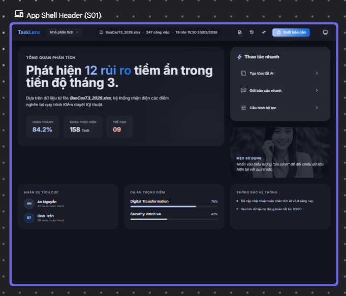
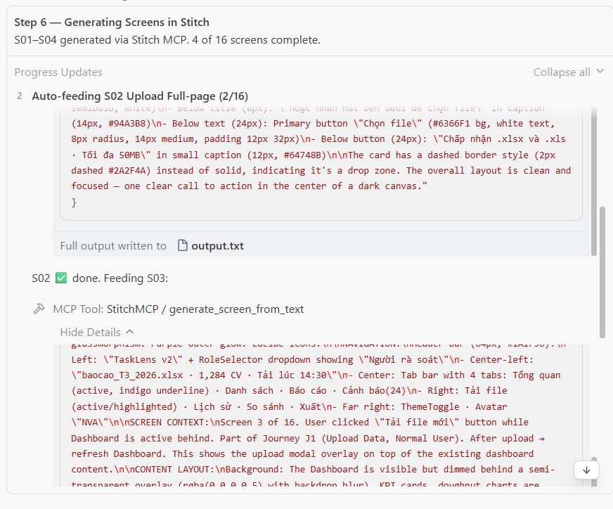

# 🧩 Stitch Wireframe Generator — Antigravity Skill

> AI đọc tài liệu mô tả phần mềm → lên kế hoạch toàn bộ màn hình → xây dựng prompt có context đầy đủ → tự động vẽ wireframe qua Google Stitch.

Một skill cho [Antigravity](https://code.google.com/assist/) giúp tự động hóa quy trình vẽ wireframe qua Google Stitch MCP. Thay vì ngồi tạo từng screen thủ công, để AI agent xử lý toàn bộ pipeline — từ phân tích tài liệu đến vẽ hệ thống hoàn chỉnh.

---

## 🤔 Vấn đề

Có hai cách vẽ wireframe với Google Stitch, và cả hai đều có hạn chế:

**Cách 1 — Upload tài liệu trực tiếp lên Stitch:**
Stitch đọc toàn bộ file, hiểu hệ thống, rồi tạo ra các screens có navigation nhất quán, data liên kết, flow rõ ràng. Kết quả tốt. Nhưng phải ngồi click tay tạo từng screen.

**Cách 2 — AI agent gọi Stitch MCP:**
AI đọc tài liệu, tự lên danh sách screens, gọi Stitch MCP để vẽ tự động. Không cần click gì. Nhưng mỗi lần gọi MCP là một session riêng — Stitch không biết screen trước đã vẽ gì. Kết quả: mỗi screen tự chọn sidebar, navigation, màu sắc riêng.

**Nhìn vào bảng dưới sẽ thấy rõ:**

| Màn hình | Sidebar | Top Navigation | Vấn đề |
|----------|---------|----------------|--------|
| App Shell Header (S01) | Không có | `Nhà phân tích · BaoCaoT3_2026.xlsx` | Header bar riêng |
| Tab Navigation (S02) | `Dashboard, Reports, History, Cảnh báo` | `Dashboard, Reports, History` | Khác hoàn toàn S01 |
| KPI Row (S05) | `Analytics, Team, Projects, Tasks, Archive` | `Dashboard, Reports, History` | Sidebar khác S02 |
| State Distribution (S06) | `Analytics, Team, Projects, Tasks, Archive` | `Dashboard, Reports, History` | Giống S05 nhưng khác S02 |
| Health Distribution (S07) | `PHÂN TÍCH, NHÓM, DỰ ÁN, CÔNG VIỆC, LƯU TRỮ` | `Phân tích, Nhóm, Dự án` | Bỗng chuyển sang chữ in hoa (!) |

Năm screens, năm hệ thống navigation khác nhau. Từng screen đứng riêng thì đẹp — nhưng ghép lại không phải một hệ thống.

### Ảnh minh họa (trước khi dùng skill)

<p align="center">
  
  
</p>
<p align="center">
  
  
</p>
<p align="center">
  
</p>

> Từng screen trông rất xịn. Nhưng để ý sidebar, top navigation, thậm chí ngôn ngữ thay đổi giữa các screens. Đó là vấn đề context.

---

## 💡 Giải pháp

Skill này kết hợp cả hai cách: **giữ lại "hiểu tổng thể" của Cách 1, cộng "tự động hoàn toàn" của Cách 2.**

Ý tưởng cốt lõi: trước khi vẽ bất kỳ screen nào, tạo ra một **Design System Spec** chung và inject vào mọi prompt. Mỗi prompt không chỉ mô tả "vẽ gì" mà còn chứa toàn bộ thông tin hệ thống: navigation structure, color palette, danh sách tất cả screens và vị trí screen hiện tại trong flow.

### Ảnh minh họa (sau khi dùng skill)

<p align="center">
  
  
</p>
<p align="center">
  
</p>

> Cùng sidebar, cùng top navigation, cùng hệ màu, data liên kết chéo — xuyên suốt 16 screens được auto-feed.

### Quá trình chạy auto-feed

Khi chạy skill ở chế độ auto-feed, AI tự động gọi Stitch MCP lần lượt cho từng screen. Đây là quá trình thực tế khi vẽ 16 screens cho TaskLens v2:

<p align="center">
  
  
</p>
<p align="center">
  
  
</p>

> AI tự đọc prompt từ thư mục `prompts/`, gọi `generate_screen_from_text` cho từng screen, log kết quả, rồi tự chuyển sang screen tiếp theo. Cả 16 screens hoàn thành mà không cần can thiệp.

---

## ✨ Skill làm được gì

- 📖 **Đọc tài liệu mô tả phần mềm** (markdown, docx, txt) và trích xuất system context
- 🎨 **Thu thập style preferences** (screenshots, brand guide, URL tham khảo, hoặc đơn giản "dark theme, minimal")
- 👥 **Đề xuất actors và journeys** cho người dùng duyệt — chỉ vẽ khi được approve
- 🎯 **Tạo Design System thống nhất** (colors, fonts, navigation) inject vào mọi screen prompt
- 📝 **Xây prompt 3 phần chi tiết** cho từng screen (Design System + Screen Map Context + Screen Content)
- 🖼️ **Tự động vẽ wireframe** qua Stitch MCP — 16 screens liền, không cần click
- 📊 **Log toàn bộ** vào thư mục project để truy vết

---

## 📦 Cài đặt

### Yêu cầu

- [Antigravity](https://code.google.com/assist/) (AI coding assistant của Google)
- [Google Stitch MCP](https://developers.google.com/stitch) đã bật trong Antigravity settings
- [Google Cloud SDK](https://cloud.google.com/sdk) (`gcloud` CLI) — chỉ cần cho chế độ script

### Các bước

1. **Clone hoặc copy skill** vào thư mục skills của Antigravity:

```
# Thư mục skills của Antigravity — thường là:
#   <workspace>/.agent/skills/
#   hoặc đường dẫn skills tùy chỉnh

git clone <repo-url> stitchSkill
```

2. **Kiểm tra skill được nhận diện:** Mở Antigravity trong workspace. Skill sẽ tự kích hoạt khi bạn hỏi về wireframe hoặc Stitch.

3. **(Tùy chọn) Cài authentication cho chế độ script:**

```powershell
# Vào thư mục skill
cd .agent/skills/stitchSkill

# Chạy setup auth (chỉ 1 lần)
powershell -File scripts/setup_auth.ps1
```

Xong. Skill sẵn sàng sử dụng.

---

## 🔐 Authentication (cho chế độ script)

> **Lưu ý:** Nếu chỉ dùng Mode A (Stitch MCP), authentication được Antigravity xử lý tự động. Phần này chỉ dành cho Mode B (script batch).

<!-- TODO: Hoàn thiện tự động hóa gcloud ADC setup -->
<!-- Script setup_auth.ps1 hiện hướng dẫn qua:
1. Kiểm tra gcloud CLI đã cài chưa
2. Chạy `gcloud auth application-default login`
3. Verify file credential được tạo
4. Test kết nối tới stitch.googleapis.com

Tạo file ~/.config/gcloud/application_default_credentials.json
chứa OAuth2 refresh_token, tự refresh vĩnh viễn. -->

```powershell
# Chạy 1 lần — mở browser để login Google
gcloud auth application-default login

# Kiểm tra
gcloud auth application-default print-access-token
```

**Trạng thái:** 🚧 Script `setup_auth.ps1` và batch generation đang trong quá trình hoàn thiện. Phương án gcloud ADC hoạt động ổn nhưng automation wrapper đang được cải thiện. Đóng góp luôn được chào đón!

---

## 🚀 Cách sử dụng

### Bắt đầu nhanh

Chỉ cần nói với AI agent:

> "Đọc file mô tả phần mềm ở `docs/product-spec.md` và vẽ wireframe cho toàn bộ hệ thống bằng stitch wireframe skill."

Agent sẽ tự động:
1. Đọc SKILL.md và thực hiện pipeline 8 bước
2. Hỏi bạn ở đúng thời điểm (không hỏi tất cả cùng lúc)
3. Vẽ toàn bộ screens vào Stitch project

### Pipeline 8 bước

```
📖 Bước 1: Đọc tài liệu & thu thập style references
     ↓
👥 Bước 2: Đề xuất actors → journeys → screens (bạn duyệt từng lớp)
     ↓
🎨 Bước 3: Xây Design System (màu → nav → layout, bạn duyệt từng phần)
     ↓
📝 Bước 4: Tạo prompt 3 phần cho mọi screen
     ↓
🔧 Bước 5: Chọn Stitch project & chế độ vẽ
     ↓
🖼️ Bước 6: Auto-feed screens theo thứ tự journey
     ↓
✏️ Bước 7: Review & chỉnh sửa
     ↓
📊 Bước 8: Xuất báo cáo
```

### Hai chế độ vẽ

| Chế độ | Cách hoạt động | Phù hợp khi |
|--------|---------------|-------------|
| **Interactive (MCP)** | AI vẽ từng screen → trình bày → chờ feedback → sửa → tiếp | < 10 screens, muốn review từng cái |
| **Auto-feed (MCP)** | AI vẽ toàn bộ liền, bạn review cuối | ≥ 10 screens, vẽ hàng loạt |

Agent sẽ gợi ý chế độ dựa trên số lượng screen, nhưng bạn luôn có thể chọn.

### Ví dụ tương tác

```
Bạn:    "Vẽ wireframe cho TaskLens v2 bằng stitch wireframe skill.
         Đây là spec: docs/tasklens-v2-spec.md"

Agent:  "Đã đọc spec và trích xuất system context.
         Anh/chị có tài liệu tham chiếu nào không — screenshots,
         brand guidelines, hoặc website nào thích phong cách?"

Bạn:    "Dark theme, minimal, giống Linear.app"

Agent:  "Ghi nhận. Từ spec, tôi nhận diện 3 actors:
         1. Analyst — sử dụng hàng ngày
         2. Unit Manager — hàng tuần
         3. Executive — hàng tháng
         
         Anh/chị đồng ý không?"

Bạn:    "Thêm System Admin"

Agent:  "Đã cập nhật. Với Analyst, tôi đề xuất các journeys sau:
         1. Dashboard Analytics → Drill-down → Export
         2. Task Management → Task Detail → Annotations
         ..."

[... hỏi từng lớp tiếp tục ...]

Agent:  "Cả 16 screens đã được duyệt. Với 16 screens,
         tôi đề xuất chế độ Auto-feed. Tiến hành?"

Bạn:    "OK"

Agent:  "Auto-feeding S01 Login Page (1/16)...
         Auto-feeding S02 Dashboard Overview (2/16)...
         ...
         Cả 16/16 screens đã tạo thành công! ✅"
```

---

## 📁 Cấu trúc dự án

```
stitchSkill/
├── SKILL.md                          # Hướng dẫn chính (pipeline 8 bước)
├── README.md                         # Bạn đang đọc file này
├── README_vi.md                      # File này (bản tiếng Việt)
├── implementation_plan.md            # Kế hoạch chi tiết (tiếng Việt)
├── implementation_plan_en.md         # Kế hoạch chi tiết (tiếng Anh)
│
├── templates/                        # Template mẫu cho từng bước
│   ├── system_context_template.md    # Bước 1 — Trích xuất system context
│   ├── screen_map_template.md        # Bước 2 — Cấu trúc screen map
│   ├── design_system_template.md     # Bước 3 — Design system spec
│   ├── screen_prompt_template.md     # Bước 4 — Prompt 3 phần cho mỗi screen
│   └── generation_log_template.md    # Bước 6 — Log quá trình vẽ
│
├── scripts/                          # Script tự động hóa (Mode B)
│   ├── setup_auth.ps1                # 🚧 Cài đặt Google ADC (1 lần)
│   ├── setup_project.js              # 🚧 Tạo/liệt kê Stitch projects qua API
│   └── batch_generate.js             # 🚧 Vẽ hàng loạt qua API
│
├── examples/                         # Ví dụ tham khảo
│   ├── tasklens_design_system.md     # Ví dụ design system (TaskLens v2)
│   ├── tasklens_screen_prompts.md    # Ví dụ screen prompts (TaskLens v2)
│   ├── createdScreens/              # Kết quả auto-feed (16 screens)
│   └── tmpScreens/                  # Screenshots so sánh
│       ├── createdByStitch/         # Kết quả upload trực tiếp
│       └── createdByAIPrompt/       # Kết quả AI prompt đơn lẻ
│
└── projects/                         # [RUNTIME] Output mỗi dự án
    └── <tên-dự-án>/
        ├── system_context.md
        ├── style_references.md
        ├── screen_map.md
        ├── design_system.md
        ├── prompts/
        │   ├── S01_login.md
        │   ├── S02_dashboard.md
        │   └── ...
        ├── generation_log.md
        └── wireframe_report.md
```

---

## 🔬 Context injection hoạt động thế nào

"Bí quyết" nằm ở cấu trúc prompt 3 phần. Mọi screen prompt đều chứa:

```
┌─────────────────────────────────────────────┐
│  PHẦN 1: DESIGN SYSTEM                     │
│  Cùng colors, fonts, nav cho TẤT CẢ screens│
│  → Sidebar: đúng các mục này, đúng thứ tự  │
│  → Top bar: layout này, elements này        │
│  → Colors: #1A1B2E bg, #6366F1 accent, ...  │
├─────────────────────────────────────────────┤
│  PHẦN 2: SCREEN MAP CONTEXT                │
│  "Đây là screen 7 trên 16."                │
│  "Thuộc Journey: Dashboard Analytics"       │
│  "Sidebar highlight: Dashboard > Detail"    │
│  "Screen trước: Dashboard Overview"         │
│  "Screen tiếp: Export Modal"                │
├─────────────────────────────────────────────┤
│  PHẦN 3: NỘI DUNG SCREEN CỤ THỂ           │
│  Layout grid, sections, components          │
│  Data mẫu — nhất quán với screens khác     │
│  Interactions, states, edge cases           │
└─────────────────────────────────────────────┘
```

Cách này đảm bảo Stitch luôn có "bức tranh toàn cảnh" cho mọi screen — giống hệt khi bạn upload tất cả tài liệu cùng lúc.

---

## 🗺️ Thư viện journey tham khảo

Skill bao gồm 12 nhóm journey để AI đề xuất flow phù hợp:

| Nhóm | Ví dụ |
|------|-------|
| Core Navigation | Login, Register, 2FA, Onboarding, Dashboard |
| Data Browsing | Master List, Detail View, Edit Form, Search, Import/Export |
| Analytics | KPI Dashboard, Drill-down, Report Builder, So sánh giữa các kỳ |
| Workflow | Kanban Board, Approval Flow, Multi-step Wizard, Alerts |
| Communication | Inbox, Thread, File Sharing, Activity Feed |
| User Management | Profile, Org Management, User Admin, Roles & Permissions |
| System Admin | Settings, Feature Toggles, Audit Logs |
| E-commerce | Product Catalog, Cart, Checkout, Order Management |
| Content | WYSIWYG Editor, Publishing Flow, Template Management |
| Map & Location | Interactive Map, Asset Tracking |
| Monitoring | System Status, Incident Management |
| Edge Cases | Empty States, Error Pages, Help Center |

AI chọn các nhóm phù hợp dựa trên tài liệu mô tả — không phải project nào cũng cần đủ 12 nhóm.

---

## 🛠️ Trạng thái & lộ trình

| Thành phần | Trạng thái | Ghi chú |
|-----------|-----------|---------|
| SKILL.md (pipeline 8 bước) | ✅ Hoàn thành | Pipeline đầy đủ với interaction rules |
| Templates (5 files) | ✅ Hoàn thành | Bao phủ tất cả bước |
| Examples (TaskLens v2) | ✅ Hoàn thành | Design system + screen prompts |
| Auto-feed qua MCP | ✅ Hoạt động | Đã test với 16 screens |
| `setup_auth.ps1` | 🚧 Đang phát triển | Flow cơ bản hoạt động, đang cải thiện automation |
| `batch_generate.js` | 🚧 Đang phát triển | API calls hoạt động, retry logic đang phát triển |
| `setup_project.js` | 🚧 Đang phát triển | CRUD project qua REST API |

---

## 🤝 Đóng góp

Skill đang được phát triển tích cực. Mọi đóng góp đều được chào đón!

**Các mảng cần đóng góp:**
- Script tự động hóa (thư mục `scripts/`) — gcloud auth wrapper, batch generation, retry logic
- Thêm ví dụ cho các loại phần mềm khác (e-commerce, SaaS, mobile app)
- Cải thiện templates dựa trên trải nghiệm thực tế
- Hỗ trợ hệ điều hành khác (hiện tại tập trung Windows/PowerShell)

**Cách đóng góp:**
1. Fork repo này
2. Tạo branch mới
3. Thực hiện thay đổi
4. Gửi pull request

---

## 📄 Giấy phép

MIT

---

## 🙏 Lời cảm ơn

- [Google Stitch](https://stitch.google.com/) — công cụ vẽ wireframe bằng AI
- [Antigravity](https://code.google.com/assist/) — AI coding assistant với hệ thống skill
- Xây dựng từ nhận thức rằng **context là tất cả** — cho AI thấy bức tranh toàn cảnh, nó sẽ vẽ ra hệ thống, không phải những màn hình rời rạc.
