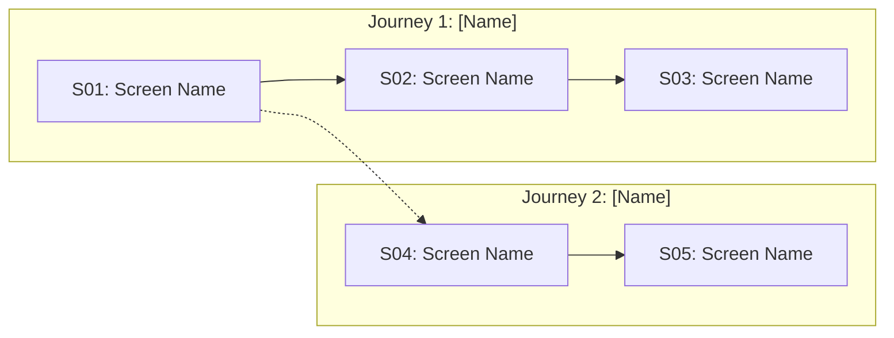

# Screen Map Template

> **Usage:** Fill this template during Step 2 after user approves actors & journeys.
> Save as: `projects/<project-name>/screen_map.md`

---

## Summary

- **Total Screens:** <!-- e.g., 24 -->
- **Actors:** <!-- e.g., 4 -->
- **Journeys:** <!-- e.g., 8 -->
- **Device Type:** <!-- Desktop / Mobile / Both -->

---

## Actors

| # | Actor | Screens | Primary Journeys |
|---|---|---|---|
| 1 | | | |
| 2 | | | |

---

## Screen List

| ID | Screen Name | Journey | Actor(s) | Description |
|---|---|---|---|---|
| S01 | | | | |
| S02 | | | | |
| S03 | | | | |
| S04 | | | | |
| S05 | | | | |

---

## Journeys

### Journey 1: [Journey Name]
**Actor(s):** [Actor Name]
**Flow:** S01 → S02 → S03

| Step | Screen ID | Screen Name | User Action | Next Screen |
|---|---|---|---|---|
| 1 | S01 | | | S02 |
| 2 | S02 | | | S03 |
| 3 | S03 | | | — |

### Journey 2: [Journey Name]
**Actor(s):** [Actor Name]
**Flow:** S04 → S05 → S06

| Step | Screen ID | Screen Name | User Action | Next Screen |
|---|---|---|---|---|
| 1 | S04 | | | S05 |
| 2 | S05 | | | S06 |

---

## Flow Diagram

---

## Navigation Mapping

<!-- Which screens are accessible from which screens via the main navigation (sidebar/topbar) -->

| Navigation Item | Target Screen | Icon |
|---|---|---|
| Dashboard | S01 | 📊 |
| Tasks | S04 | ✅ |
| Settings | S10 | ⚙️ |

---

## Shared Components

<!-- Components that appear on multiple screens -->

| Component | Appears On | Description |
|---|---|---|
| Sidebar | All screens | Main navigation |
| Top Bar | All screens | Search, notifications, user menu |
| | | |
